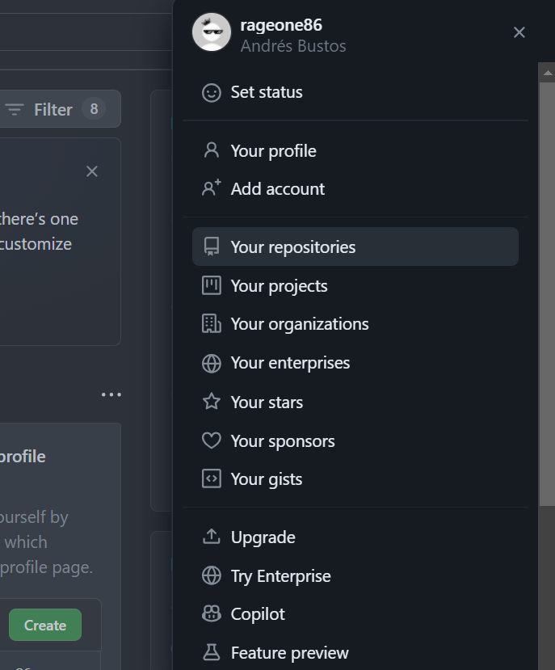
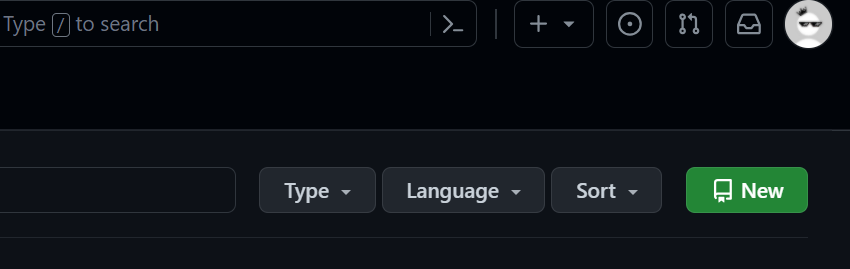
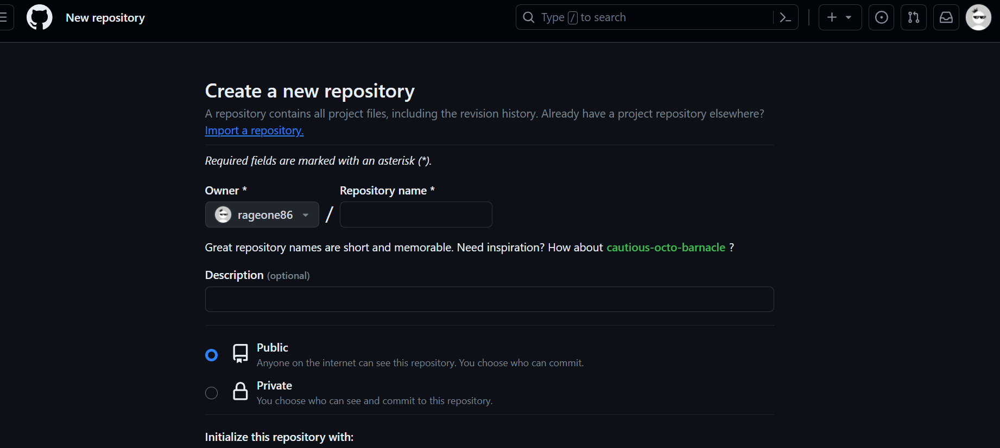
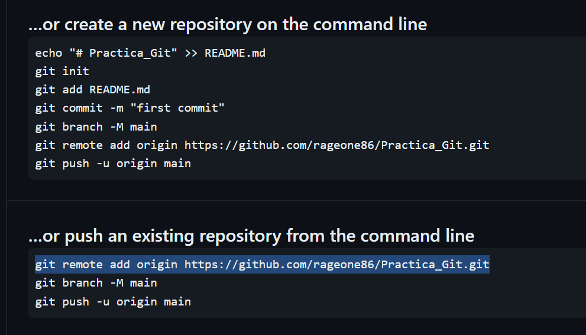

### PRÁCTICA GIT, MARKDOWN, GITHUB

* Andrés Bustos Valdearenas
* Lenguaje de Marcas
* IES Aguadulce
* 1º DAW


## BLOQUES DE CÓDIGO DE MARKDOWN

# Creación del repositorio en nuestro ordenador (init):

* Abro git Bash y verifico la version de git. Entro dentro de la carpeta Downloads y creo una carpeta con el nombre tarea-git. Entro en esa carpeta y creo el archivo README.md.

```
andre@Andrew MINGW64 ~/downloads
$ git --version
git version 2.43.0.windows.1

andre@Andrew MINGW64 ~
$ cd downloads

andre@Andrew MINGW64 ~/downloads
$ git init tarea-git
Initialized empty Git repository in C:/Users/andre/Downloads/tarea-git/.git/

andre@Andrew MINGW64 ~/downloads
$ cd tarea-git

andre@Andrew MINGW64 ~/downloads/tarea-git (master)
$ touch README.md

andre@Andrew MINGW64 ~/downloads/tarea-git (master)
$ dir
README.md

```

# Creación de un commit inicial (add, status, commit, log):

* Verifico el estado de los archivos con git status y observamos que no tengo ningún commit: 

```
andre@Andrew MINGW64 ~/downloads/tarea-git (master)
$ git status
On branch master

No commits yet

Untracked files:
  (use "git add <file>..." to include in what will be committed)
        README.md

nothing added to commit but untracked files present (use "git add" to track)
```

* Definimos los valores de configuración con git config:

```
andre@Andrew MINGW64 ~/downloads/tarea-git (master)
$ git config --global user.name "Andres"

andre@Andrew MINGW64 ~/downloads/tarea-git (master)
$ git config --global user.email "andreubv_86@hotmail.com"
```

* Añado el archivo README.md con git add y compruebo con git status que no tiene commit:

```
andre@Andrew MINGW64 ~/downloads/tarea-git (master)
$ git add README.md

andre@Andrew MINGW64 ~/downloads/tarea-git (master)
$ git status
On branch master

No commits yet

Changes to be committed:
  (use "git rm --cached <file>..." to unstage)
        new file:   README.md
```

* Hacemos un commit y después comprobamos con git status:

```
andre@Andrew MINGW64 ~/downloads/tarea-git (master)
$ git commit -m "añado README.md"
[master (root-commit) a224a3c] añado README.md
 1 file changed, 0 insertions(+), 0 deletions(-)
 create mode 100644 README.md

andre@Andrew MINGW64 ~/downloads/tarea-git (master)
$ git status
On branch master
nothing to commit, working tree clean

```


* Con git log comprabamos el commit, autor y fecha:
```
andre@Andrew MINGW64 ~/downloads/tarea-git (master)
$ git log
commit a224a3c59986b749df8d10db537f2357d5deba19 (HEAD -> master)
Author: Andres <andreubv_86@hotmail.com>
Date:   Mon Jan 15 18:58:35 2024 +0100

    añado README.md

```

* Compruebo en que rama estoy:

```
andre@Andrew MINGW64 ~/downloads/tarea-git (master)
$ git branch
* master

andre@Andrew MINGW64 ~/downloads/tarea-git (master)
$
```

# Creación del repositorio en Github:

* Entramos en GitHub y en la parte superior derecha pinchamos en nuestra foto y abrimos Your Repositories  



* Seleccionamos New en la parte derecha y se nos abre esta pantalla





* Ponemos el nombre al repositorio y nos aparece esta pantalla donde copiamos la frase git remote:




# Añadir el remoto al repositorio local (branch, remote):

* Pegamos el git remote en la terminal de git Bash:

```
andre@Andrew MINGW64 ~/downloads/tarea-git (master)
$ git remote add origin https://github.com/rageone86/Practica_Git.git
```

# Subir el repositorio a Github (push):

* Con git Push subimos el repositorio a Github:

```
andre@Andrew MINGW64 ~/downloads/tarea-git (master)
$ git push origin master
Enumerating objects: 3, done.
Counting objects: 100% (3/3), done.
Writing objects: 100% (3/3), 225 bytes | 225.00 KiB/s, done.
Total 3 (delta 0), reused 0 (delta 0), pack-reused 0
To https://github.com/rageone86/Practica_Git.git
 * [new branch]      master -> master
```

